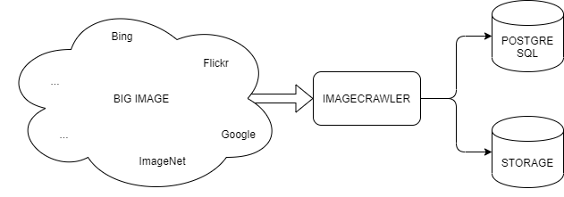

# imagecrawler

[](https://github.com/craftslab/imagecrawler/actions?query=workflow%3ACI)
[](https://goreportcard.com/report/github.com/craftslab/imagecrawler)
[](https://github.com/craftslab/imagecrawler/blob/master/LICENSE)
[](https://github.com/craftslab/imagecrawler/tags)


## Introduction

*imagecrawler* is an image crawler written in Go.


## Prerequisites

- Colly >= 2.1.0
- Go >= 1.15.0


## Build

```bash
git clone https://github.com/craftslab/imagecrawler.git

cd imagecrawler
make build
```


## Run

```bash
./imagecrawler --config-file="config.yml" --output-file="output.json"
```


## Docker

```bash
git clone https://github.com/craftslab/imagecrawler.git

cd imagecrawler
docker build --no-cache -f Dockerfile -t craftslab/imagecrawler:latest .
docker run -it -v /tmp:/tmp craftslab/imagecrawler:latest ./bin/imagecrawler --config-file="./etc/config.yml" --output-file="/tmp/output.json"
```


## Usage

```
TBD
```


## Settings

*imagecrawler* parameters can be set in the directory [config](https://github.com/craftslab/imagecrawler/blob/master/config).

An example of configuration in [config.yml](https://github.com/craftslab/imagecrawler/blob/master/config/config.yml):

```yaml
TBD
```


## Design




## License

Project License can be found [here](LICENSE).


## Reference

- [go-colly](http://go-colly.org/)
